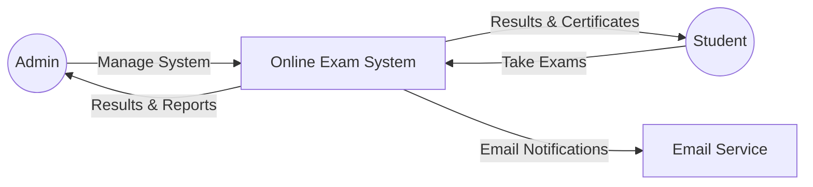
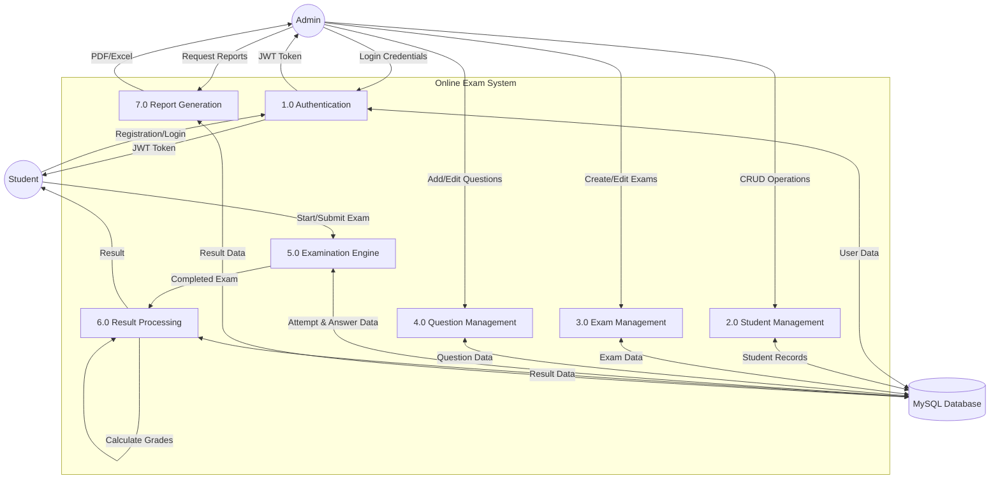
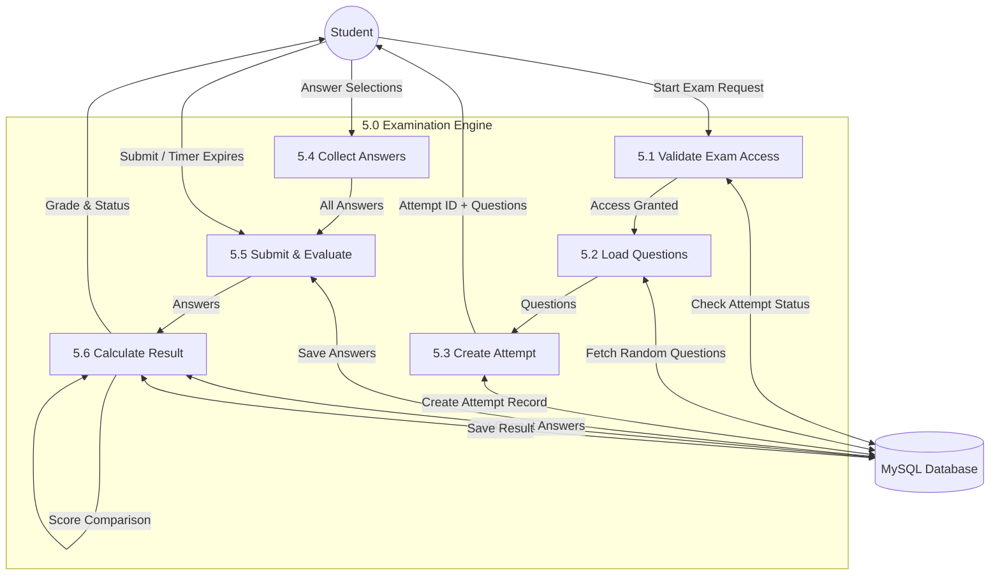
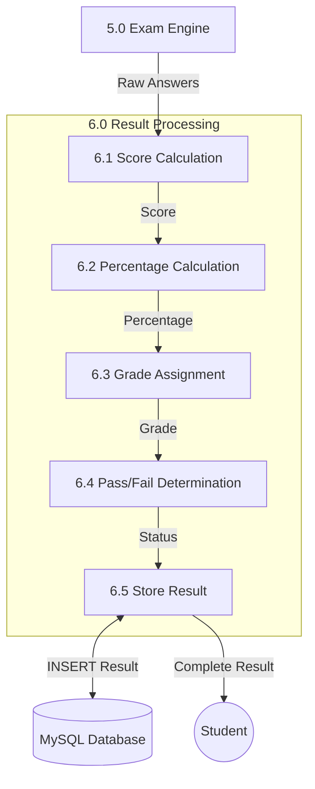

# Data Flow Diagrams — Online Examination and Result Management System

## DFD Level 0 — Context Diagram

## DFD Level 1

## DFD Level 2 — Examination Engine (Process 5.0)

## DFD Level 2 — Result Processing (Process 6.0)

