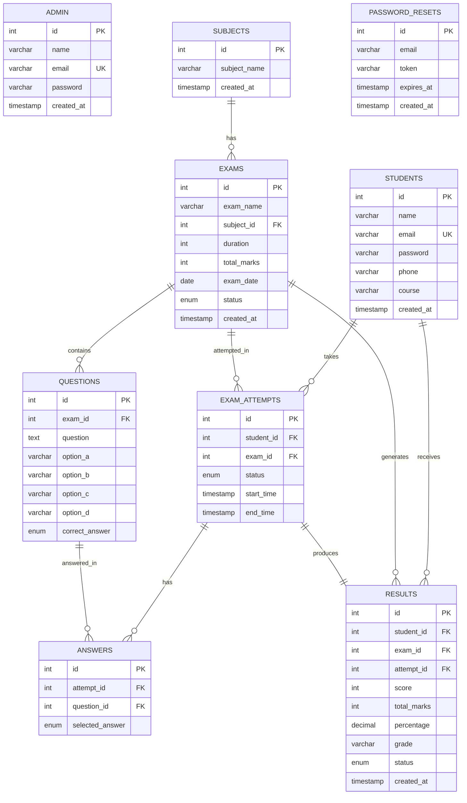

# ER Diagram — Online Examination and Result Management System

## Entity Relationship Diagram

## Relationships

| Relationship | Type | Description |
|-------------|------|-------------|
| Subject → Exam | One-to-Many | Each subject can have multiple exams |
| Exam → Question | One-to-Many | Each exam contains multiple MCQ questions |
| Student → Exam Attempt | One-to-Many | A student can attempt multiple exams |
| Exam → Exam Attempt | One-to-Many | An exam can be attempted by multiple students |
| Exam Attempt → Answer | One-to-Many | Each attempt records multiple answers |
| Exam Attempt → Result | One-to-One | Each completed attempt generates one result |
