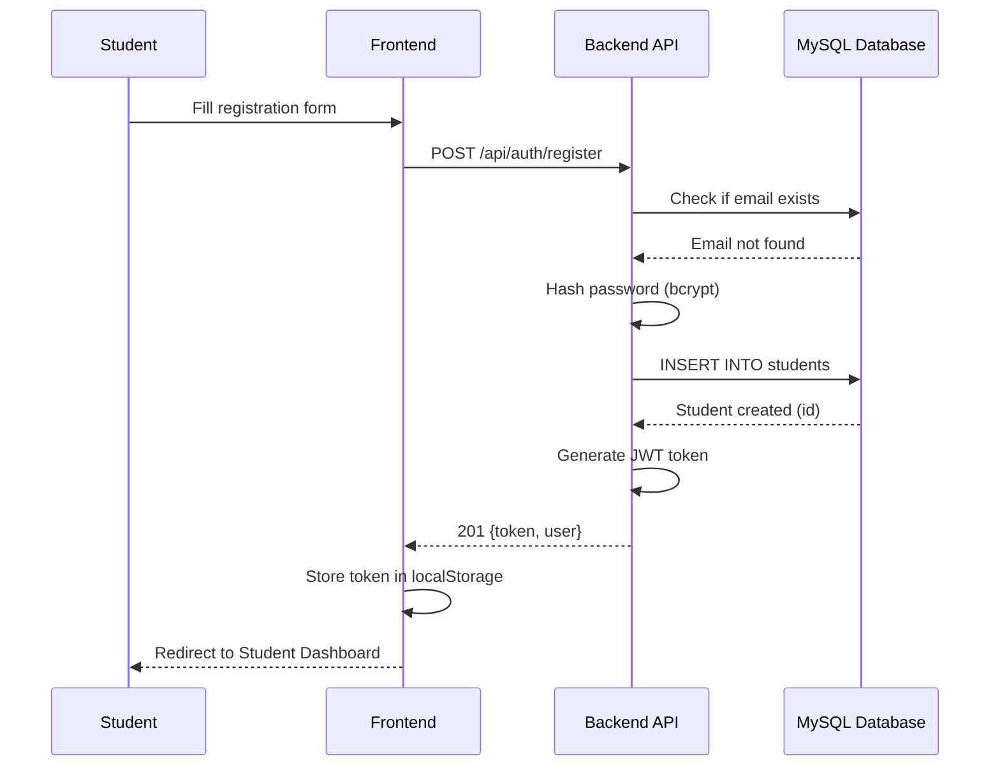
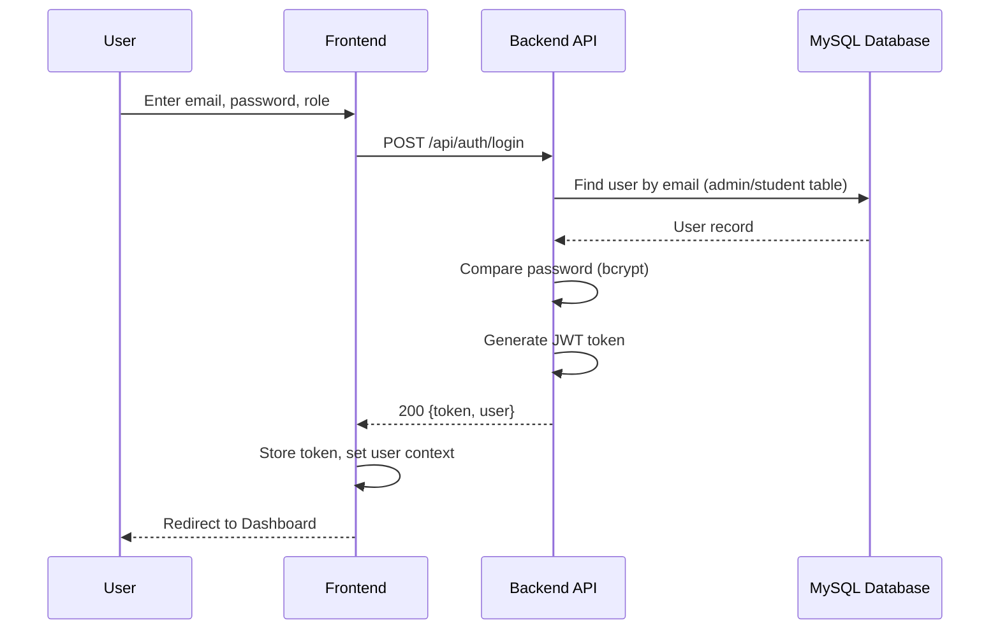
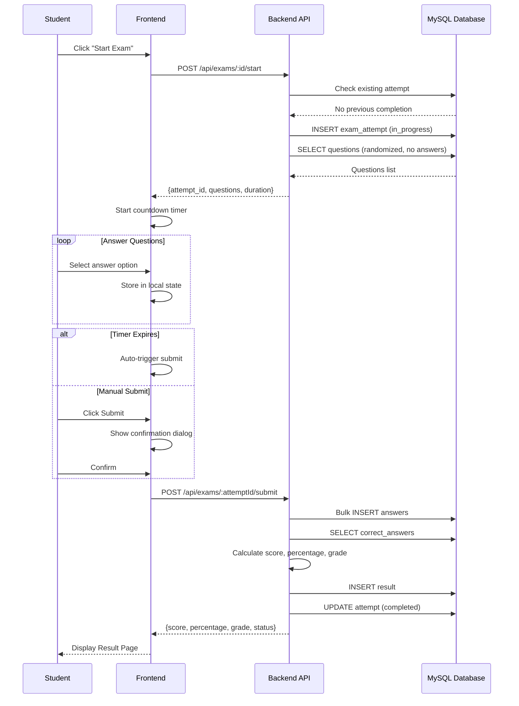
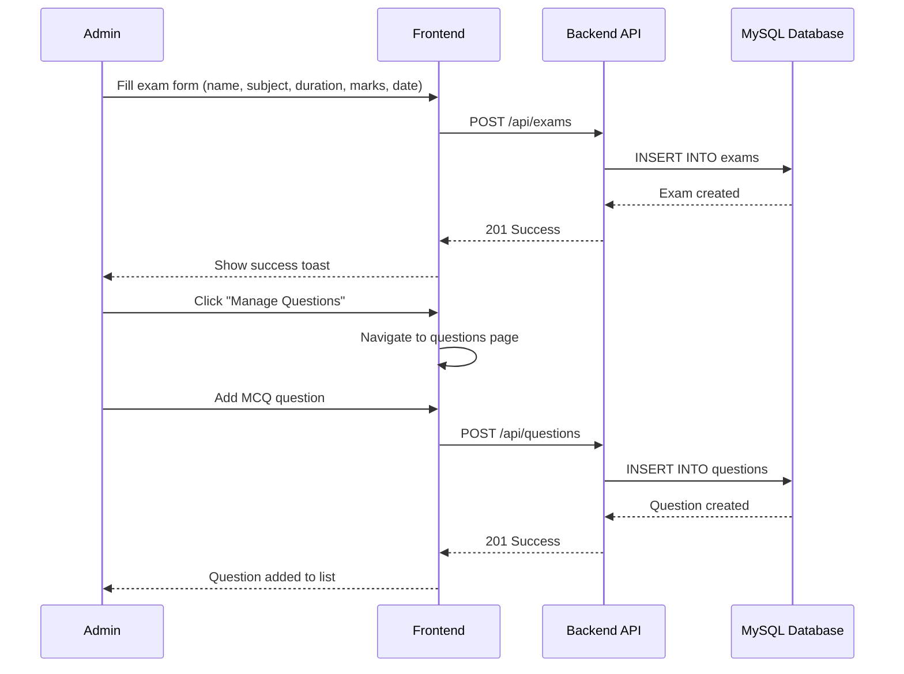
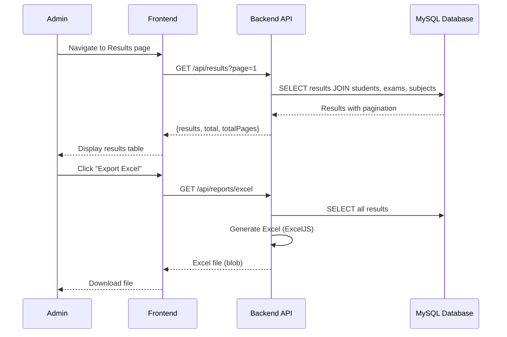

# Sequence Diagrams — Online Examination and Result Management System

## 1. Student Registration

## 2. Login Flow

## 3. Take Exam Flow

## 4. Admin Creates Exam

## 5. View Results & Generate Report

