# Use Case Diagram — Online Examination and Result Management System

## System Use Case Diagram

```mermaid
graph TB
    subgraph System["Online Examination and Result Management System"]
        UC1[Login]
        UC2[Register]
        UC3[Forgot Password]
        UC4[Manage Students]
        UC5[Manage Subjects]
        UC6[Manage Exams]
        UC7[Manage Questions]
        UC8[View Dashboard]
        UC9[View Results]
        UC10[Generate Reports]
        UC11[Export PDF/Excel]
        UC12[View Available Exams]
        UC13[Take Online Exam]
        UC14[View Exam Result]
        UC15[View Exam History]
        UC16[View Leaderboard]
        UC17[Manage Profile]
        UC18[Change Password]
    end

    Admin((Admin))
    Student((Student))

    Admin --> UC1
    Admin --> UC4
    Admin --> UC5
    Admin --> UC6
    Admin --> UC7
    Admin --> UC8
    Admin --> UC9
    Admin --> UC10
    Admin --> UC11

    Student --> UC1
    Student --> UC2
    Student --> UC3
    Student --> UC12
    Student --> UC13
    Student --> UC14
    Student --> UC15
    Student --> UC16
    Student --> UC17
    Student --> UC18
```

## Use Case Descriptions

### UC1: Login
- **Actor**: Admin, Student
- **Description**: Users authenticate with email and password
- **Precondition**: User has a registered account
- **Postcondition**: User receives JWT token and is redirected to dashboard

### UC2: Student Registration
- **Actor**: Student
- **Description**: New students register with name, email, password, phone, course
- **Precondition**: Email is not already registered
- **Postcondition**: Account created, JWT token issued

### UC6: Manage Exams
- **Actor**: Admin
- **Description**: Create, edit, delete exams with subject, duration, total marks, date
- **Includes**: UC7 (Manage Questions)

### UC13: Take Online Exam
- **Actor**: Student
- **Description**: Timed MCQ exam with one question per page, navigation, auto-submit
- **Precondition**: Exam is active, student has not already completed it
- **Postcondition**: Answers saved, result calculated automatically
